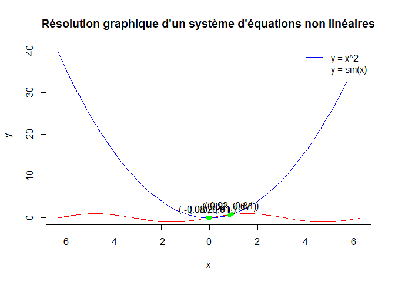
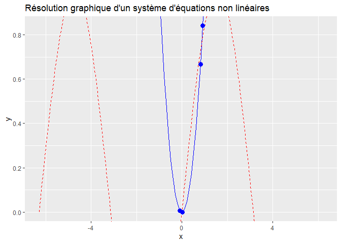
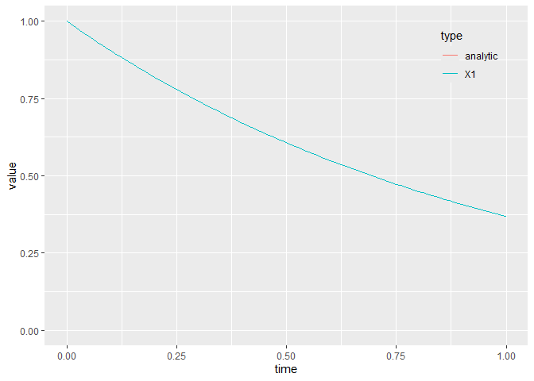

# Résolution des équations non linéaires avec le logiciel R
### RStudio est un environnement de développement gratuit, libre et multiplateforme pour R, un langage de programmation utilisé pour le traitement de données et l’analyse statistique.Dans notre contexte,nous allons utiliser RStudio poour la résolution des équations non linéaire.Les équations non linéaires sont des équations dont le degré est supérieure à 1

## Installation et Importation des Packages


```r
# Installer et charger le  lpSolve
#install.packages
#install.packages("rootSolve")
#install.packages("nleqslv")
library(lpSolve)
library(haven)
library(nleqslv)
library(rootSolve)
library(magrittr)
library(dplyr)
```

```
## 
## Attachement du package : 'dplyr'
```

```
## Les objets suivants sont masqués depuis 'package:stats':
## 
##     filter, lag
```

```
## Les objets suivants sont masqués depuis 'package:base':
## 
##     intersect, setdiff, setequal, union
```

```r
library(tidyr)
```

```
## 
## Attachement du package : 'tidyr'
```

```
## L'objet suivant est masqué depuis 'package:magrittr':
## 
##     extract
```

```r
library(rootSolve)
library(nleqslv)
library(pracma)
```

```
## 
## Attachement du package : 'pracma'
```

```
## Les objets suivants sont masqués depuis 'package:magrittr':
## 
##     and, mod, or
```

```
## Les objets suivants sont masqués depuis 'package:rootSolve':
## 
##     gradient, hessian
```

```r
library(stats)
library(reshape)
```

```
## 
## Attachement du package : 'reshape'
```

```
## Les objets suivants sont masqués depuis 'package:tidyr':
## 
##     expand, smiths
```

```
## L'objet suivant est masqué depuis 'package:dplyr':
## 
##     rename
```

```r
library(ggplot2)
library(deSolve)
```

```
## 
## Attachement du package : 'deSolve'
```

```
## L'objet suivant est masqué depuis 'package:pracma':
## 
##     rk4
```
# Présentation des differents packages

### Dans cette partie, nous mettons en exergue les packages nécessaires à la resolution des équations non linéaires.L'Objectif finale est de pouvoir optimiser nos differentes données en fonction du besoin. Nous pouvons par exemples optimiser les couts de production d'une entreprise,les dépenses publiques de l'Etat,les profits d'une entreprise etc...

## Utilisation du Package "rootSolve"


```r
# Chargement du package

# Définition du système d'équations
equations <- function(x) {
  # Définition des équations du système
  equation_1 <- 3*x[1]^2 + x[2]^2 - 1    
  equation_2 <- 5*x[1]^2 - 2*x[2]^2 + 4
                              
  # Retourner les équations sous forme de vecteur
  return(c(equation_1, equation_2))
}

# Vecteur initial de valeurs approchées pour les variables
point_de_départ <- c(1, 1)

# Résolution du système d'équations non linéaires
solution <- multiroot(f = equations, start = point_de_départ)

# Affichage des solutions
print(solution$root)
```

```
## [1] 0.05274924 1.24316312
```

```r
# AUTRES ARGUMENTS
           #tolerance =  : pour définir une tolérance plus stricte pour la convergence.
            #maxiter: pour spécifier le nombre maximal d'itérations autorisées
```

## Utilisation du Package "nleqslv"


```r
# Chargement du package nleqslv

# Définition de la fonction du système d'équations
systeme_equations <- function(x) {
  eq1 <- 3*x[1]^2 + x[2]^2 - 1
  eq2 <- 5*x[1]^2 - 2*x[2]^2 + 4
  return(c(eq1, eq2))
}

# Résolution du système d'équations avec la méthode de Newton
solution <- nleqslv(c(1, 1), 
                    systeme_equations, 
                    method = "Newton")

# Affichage des solutions
print(solution$x)
```

```
## [1] 0.0001561915 1.3416407895
```

```r
# afficher l'intervalle de validité de la solution

print(solution$fvec) 
```

```
## [1] 0.8000001 0.4000001
```

```r
## afficher le nombre d'ittération
print(solution$iter)
```

```
## [1] 11
```
## Utilisation du Package "pracma"


```r
# Définition du système d'équations
equations <- function(x) {
  pracma_1 <- x[1]^2 + x[2]^2 +200
  pracma_2 <- x[1]^2 - x[2]^2 -1000
  return(c(pracma_1, pracma_2))
}

# Spécification des valeurs initiales pour les variables
initial_guess <- c(1, 1)

# Résolution du système d'équations non linéaires
solution <- fsolve(equations, initial_guess)

# Affichage des solutions
print(solution)
```

```
## $x
## [1] -20.000000   1.043737
## 
## $fval
## [1]  601.0894 -601.0894
```


## Utilisation du Package "stats"


```r
# Définition de la fonction d'utilité et de la contrainte budgétaire
utilite <- function(x) {
  utilité <- - (x[1]^2 + x[2]^2)
  return(utilité)
}

contrainte_budg <- function(x) {
  revenu_total <- -1000 +x[1] + x[2] 
  return(revenu_total)
}

# Fonction objectif (utilité sous contrainte)
fonction_objectif <- function(x_lambda) {
  x <- x_lambda[1:2]
  lambda <- x_lambda[3]
  return((utilite(x) - lambda * contrainte_budg(x)))
}

# Variables initiales
x0 <- c(0, 0)  # Valeurs initiales pour x1 et x2
lambda0 <- 1        # Valeur initiale de lambda

# Résolution du problème d'optimisation
resultat <- optim(c(x0, lambda0), fonction_objectif, method = "BFGS")

# Affichage des résultats
x_opt <- resultat$par[1:2]
lambda_opt <- resultat$par[3]
revenu_max <- -resultat$value

cat("Les quantités optimales sont :", x_opt, "\n")
```

```
## Les quantités optimales sont : -1.511598e+14 -1.511598e+14
```

```r
cat("Le revenu maximal est :", revenu_max, "\n")
```

```
## Le revenu maximal est : 9.096186e+28
```

```r
cat("La valeur optimale de lambda est :", lambda_opt, "\n")
```

```
## La valeur optimale de lambda est : -1.497199e+14
```


## Utilisation de la Fonction optim
### Certaines fonctions de R Permettent egaalement de resoudre les équations non linéaires. Dans cette SEction,nous utiliserons la fonction Optim pour resoudre le système d'équation non linéaire 


```r
# Définition de la fonction f à deux inconnus
f <- function(xy) {
  x <- xy[1]
  y <- xy[2]
  return((x - 2)^2 + (y + 3)^2)
  
}

# Initialisation d'une valeur de départ pour l'optimisation
xy_start <- c(0, 0)

# Utilisation de la fonction optim pour trouver le minimum de la fonction f
result <- optim(xy_start, f)

# Affichage du résultat
print(result)
```

```
## $par
## [1]  1.999823 -3.000005
## 
## $value
## [1] 3.144259e-08
## 
## $counts
## function gradient 
##       65       NA 
## 
## $convergence
## [1] 0
## 
## $message
## NULL
```

## Résolution avec les matrices 


```r
# Définir la matrice des coefficients
A <- matrix(c(3, 2, 4, -1), nrow = 2, byrow = TRUE)
# Définir le vecteur
B <- c(11, 3)
# Résoudre le système
X <- solve(A, B)
print(X)
```

```
## [1] 1.545455 3.181818
```

```r
## [1] 1.545455 3.181818
# Calculer AX
AX <- A %*% X
# Vérifier si AX est égal à B
identical(AX, B)
```

```
## [1] FALSE
```

```r
## [1] FALSE
```

## Résolution graphique
### La resolution graphique permet de mieux visualiser nos Resultats et de faire une comparaison avec la methode algebrique
#### Exeemple 1

```r
# Définir les fonctions d'équations
equation1 <- function(x) {
  return(x^2)
}

equation2 <- function(x) {
  return(sin(x))
}

# Générer des valeurs de x pour le traçage
x <- seq(-2*pi, 2*pi, by = 0.1)

# Traçage des courbes
plot(x, equation1(x), type = "l", col = "blue", xlab = "x", ylab = "y", main = "Résolution graphique d'un système d'équations non linéaires")
lines(x, equation2(x), col = "red")

# Ajouter une légende
legend("topright", legend = c("y = x^2", "y = sin(x)"), col = c("blue", "red"), lty = 1)

# Trouver les points d'intersection
intersection_points <- data.frame(x = NULL, y = NULL)
for(i in 1:length(x)) {
  if(abs(equation1(x[i]) - equation2(x[i])) < 0.1) {
    intersection_points <- rbind(intersection_points, data.frame(x = x[i], y = equation1(x[i])))
  }
}

# Afficher les points d'intersection avec les valeurs des solutions (facultatives)
points(intersection_points$x, intersection_points$y, col = "green", pch = 16)
text(intersection_points$x, intersection_points$y, labels = paste("(", round(intersection_points$x, 2), ",", round(intersection_points$y, 2), ")"), pos = 3)
```

<!-- -->

```r
# Afficher les valeurs des solutions
print(intersection_points)
```

```
##             x            y
## 1 -0.08318531 0.0069197953
## 2  0.01681469 0.0002827339
## 3  0.81681469 0.6671862424
## 4  0.91681469 0.8405491810
```
#### Exeemple 2


```r
# Définir les fonctions d'équations
equation1 <- function(x) {
  return(x^2)
}

equation2 <- function(x) {
  return(sin(x))
}

# Générer des valeurs de x pour le traçage
x <- seq(-2*pi, 2*pi, by = 0.1)

# Assuming x, equation1, and equation2 are defined

library(ggplot2)

# Create the ggplot2 object

ggplot(data = data.frame(x = x), aes(x = x)) +

  # Add the first curve (blue) with label
  geom_line(y = equation1(x), col = "blue", linetype = "solid", label = "Equation 1") +

  # Add the second curve (red) with label
  geom_line(y = equation2(x), col = "red", linetype = "dashed", label = "Equation 2") +

  # Add intersection points (assuming intersection_points is a data frame)
  geom_point(data = intersection_points, aes(x = intersection_points$x, y = intersection_points$y), 
             col = "blue", pch = 16, size = 3) +  # Adjust size as needed

  # Customize plot elements
  labs(x = "x", y = "y") +
  ggtitle("Résolution graphique d'un système d'équations non linéaires") +

  # Add the legend with updated syntax
  scale_linetype_discrete(name = "Légende") +
  guides(linetype = guide_legend(title.position = "top"))  # Legend positioning
```

<!-- -->

# Equations Linéaires Ordinaire classique: Modèle de Lorenz

### Une équation différentielle est une équation entre une ou plusieurs fonctions inconnues et leurs dérivées. Elle décrit comment une fonction varie par rapport à une ou plusieurs variables (souvent le temps et/ou l’espace) et par rapport à ses dérivées. Il y a différentes facon de classifier les équations différentielles.les équations peuvent être stochastique (la quantité inconnue est aléatoire) ou déterministe (la quantité inconnue est déterministe).Elles peuvent porter sur des fonctions à une seule variable (équation différentielle ordinaire) ou à plusieurs variables (équation aux dérivées partielles).les équations peuvent inclure des fonctions dont la dérivée à un certain pas de temps dépend de la dérivée à un pas de temps précédent (équation différentielle à retard ou differential equations delay). Elles peuvent aussi inclure des relations algébriques entre les variables (équation différentielle algébrique).Il existe plusieurs packages R permettant de résoudre ces équations et d’ajuster ces modèles à de la donnée. Ici, seuls les package deSolve et diffeqr sont utilisés pour résoudre des ED. On cherche à résoudre y′=ay. Avec condition initiale y(0)=y0. On commence par coder l’équation différentielle: - t représente le temps courant - Y représente l’état courant du système - parameters stocke les paramètres du modèle.


```r
model <- function(t, Y, parameters) {
  with(as.list(parameters), {
    dy = -a * Y
    list(dy)
  })
}

# On renseigne ensuite la jacobienne ∂y′∂y

jac <- function(t, Y, parameters) {
  with(as.list(parameters), {
    PD[1, 1] <- a
    return(PD)
  })
}

# On peut ensuite résoudre l’EDO pour a=1 et y0=1 sur l’intervalle [0,1] des pas de temps de longeur 0.01

#comme suit:
params <- c(a = 1)
y0     <- c(1)
times  <- seq(0, 1, by = 0.01)
PD     <- matrix(0, nrow = 1, ncol = 1)
out_atome <- ode(y0, times, model, parms = params, jacfun = jac)

# Le résultat est une matrice: - une colonne pour le temps (reprend les valeurs de times) - une colonne par dimension dans le système d’équationsdifférentielles

#/*On peut vérifier que la solution numérique (en bleu) est confondue avec la solution analytique (en rouge)./*

plot_data <- data.frame(out_atome) %>%
  mutate(analytic = exp(-time)) %>%
  pivot_longer(cols = -time,
               names_to = "type",
               values_to = "value")
ggplot(plot_data, aes(x = time, y = value, color = type)) +
  geom_line() +
  ylim(0, 1) +
  theme(legend.position = c(0.95, 0.95),
        legend.justification = c(1, 1),
        legend.background = element_rect(fill = NA))
```

<!-- -->

```r
    diagnostics(out_atome)
```

```
## 
## --------------------
## lsoda return code
## --------------------
## 
##   return code (idid) =  2 
##   Integration was successful.
## 
## --------------------
## INTEGER values
## --------------------
## 
##   1 The return code : 2 
##   2 The number of steps taken for the problem so far: 102 
##   3 The number of function evaluations for the problem so far: 133 
##   5 The method order last used (successfully): 6 
##   6 The order of the method to be attempted on the next step: 6 
##   7 If return flag =-4,-5: the largest component in error vector 0 
##   8 The length of the real work array actually required: 36 
##   9 The length of the integer work array actually required: 21 
##  14 The number of Jacobian evaluations and LU decompositions so far: 0 
##  15 The method indicator for the last succesful step,
##            1=adams (nonstiff), 2= bdf (stiff): 1 
##  16 The current method indicator to be attempted on the next step,
##            1=adams (nonstiff), 2= bdf (stiff): 1 
##  
## --------------------
## RSTATE values
## --------------------
## 
##   1 The step size in t last used (successfully): 0.01 
##   2 The step size to be attempted on the next step: 0.01 
##   3 The current value of the independent variable which the solver has reached: 1.00002 
##   4 Tolerance scale factor > 1.0 computed when requesting too much accuracy: 0 
##   5 The value of t at the time of the last method switch, if any: 0 
## 
```

## Exercice 1
### Résoudre d'un programme simplex: Production de papier. L'énoncer de cet Exercice se trouve dans le fichier Word.L’objectif de cet exercice est d’analyser une stratégie marketing sur différents supports médiatiques (télévision, radio et journaux) et de prendre des décisions en fonction de la rentabilité et de la portée potentielle des clients


```r
# Définir la fonction objective et les contraintes
obj <- c(400, 900, 500, 200)
mat <- matrix(c(40, 75, 30, 15,   # Contrainte 1
                -30, -40, -20, -10,   # Contrainte 2
                40, 75, 0, 0,   # Contrainte 3
                -1, 0, 0, 0,   # Contrainte 4
                0, -1, 0, 0,   # Contrainte 5
                0, 0, 1, 0,   # Contrainte 6
                0, 0, -1, 0,  # Contrainte 7
                0, 0, 0, 1,   # Contrainte 8
                0, 0, 0, -1), # Contrainte 9
              nrow = 9, byrow = TRUE)
dir <- c("<=", ">=", "<=", ">=", "<=", "<=", "<=", ">=", "<=")
rhs <- c(800, -2000, 500, -3, -2, 10, -5, 10, -5)
```


```r
result <- lp(direction = "max", objective.in = obj, const.mat = mat, const.dir = dir, const.rhs = rhs)
# Afficher les quantités optimales
if (result$status == 0) {
  print(paste("x1 =", result$solution[1]))
  print(paste("x2 =", result$solution[2]))
  print(paste("x3 =", result$solution[3]))
  print(paste("x4 =", result$solution[4]))
} else {
  print("Aucune solution optimale trouvée.")
}
```

```
## [1] "x1 = 0"
## [1] "x2 = 2"
## [1] "x3 = 10"
## [1] "x4 = 23.3333333333333"
```

```r
print(result)
```

```
## Success: the objective function is 11466.67
```

# Exercice 2
### La répartition équitable des budgets entre les secteurs clés tels que l’éducation, la santé, l’armée et les infrastructures dans les pays de l’Afrique de l’Ouest est une démarche essentielle pour plusieurs raisons :
### Optimisation des ressources financières : Elle permet d’allouer suffisamment de fonds à chaque secteur, favorisant le développement des compétences et la croissance économique à long terme.
### Stabilité sociale et politique : Une répartition équilibrée répond aux besoins fondamentaux de la population, tels que les soins de santé et les infrastructures, renforçant ainsi la stabilité sociale et politique.
### Prévention des déséquilibres et des inégalités : Favorise un développement durable et harmonieux dans la région.
### L’optimisation sera faite de la manière suivante:


```r
# Données pour les pays de l'Afrique de l'Ouest
pays <- c("Bénin", "Burkina Faso", "Cap-Vert", "Côte d'Ivoire", "Gambie", "Ghana", "Guinée", "Guinée-Bissau", "Liberia", "Mali", "Niger", "Nigeria", "Sénégal", "Sierra Leone", "Togo")
budget <- c(1000, 1200, 1100, 1300, 900, 1400, 1500, 1600, 1700, 1800, 1900, 2000, 2100, 2200, 2300) # Budgets spécifiques pour chaque pays
# Secteurs clés et poids
secteurs <- c("Education", "Santé", "Armée", "Infrastructures")
poids <- c(0.3, 0.3, 0.2, 0.2) # Poids pour chaque secteur

# Création du dataframe
data <- data.frame(Pays = pays, budget , Education = 0, Santé = 0, Armée = 0, Infrastructures = 0)
print(data)
```

```
##             Pays budget Education Santé Armée Infrastructures
## 1          Bénin   1000         0     0     0               0
## 2   Burkina Faso   1200         0     0     0               0
## 3       Cap-Vert   1100         0     0     0               0
## 4  Côte d'Ivoire   1300         0     0     0               0
## 5         Gambie    900         0     0     0               0
## 6          Ghana   1400         0     0     0               0
## 7         Guinée   1500         0     0     0               0
## 8  Guinée-Bissau   1600         0     0     0               0
## 9        Liberia   1700         0     0     0               0
## 10          Mali   1800         0     0     0               0
## 11         Niger   1900         0     0     0               0
## 12       Nigeria   2000         0     0     0               0
## 13       Sénégal   2100         0     0     0               0
## 14  Sierra Leone   2200         0     0     0               0
## 15          Togo   2300         0     0     0               0
```

### Effectuons la repartition optimale des Budgets en fonction des Secteurs stratégiques 


```r
# base de données 
pays <- c("Bénin", "Burkina Faso", "Cap-Vert", "Côte d'Ivoire", "Gambie", "Ghana", "Guinée", "Guinée-Bissau", "Liberia", "Mali", "Niger", "Nigeria", "Sénégal", "Sierra Leone", "Togo")
budget <- c(1000, 1200, 1100, 1300, 900, 1400, 1500, 1600, 1700, 1800, 1900, 2000, 2100, 2200, 2300) # Budgets spécifiques pour chaque pays

# Générer des allocations sectorielles fixes pour chaque pays
poid_agriculture <- c(400, 450, 350, 500, 300, 450, 400, 350, 500, 450, 400, 500, 450, 400, 350)
poid_industrie <- c(400, 450, 350, 500, 300, 450, 400, 350, 500, 450, 400, 500, 450, 400, 350)
poid_education <- c(300, 350, 250, 400, 200, 350, 300, 250, 400, 350, 300, 400, 350, 300, 250)
poid_sante <- c(75, 85, 65, 95, 55, 85, 75, 65, 95, 85, 75, 95, 85, 75, 65)
poid_infrastructure <- c(35, 40, 30, 45, 25, 40, 35, 30, 45, 40, 35, 45, 40, 35, 30)
poid_recherche <- c(50, 60, 40, 70, 30, 60, 50, 40, 70, 60, 50, 70, 60, 50, 40)

data <- data.frame(pays, budget, poid_agriculture, poid_industrie, poid_education, poid_sante, poid_infrastructure, poid_recherche)


# Début de la boucle
for (i in 1:nrow(data)) {
  # Extraire les valeurs nécessaires pour l'itération i
  budget <- data$budget[i]
  agriculture <- data$poid_agriculture[i]
  industrie <- data$poid_industrie[i]
  education <- data$poid_education[i]
  sante <- data$poid_sante[i]
  infrastructure <- data$poid_infrastructure[i]
  
  # Définir la fonction du solveur
  mysolver <- function(p) {
    a <- p[1]
    b <- p[2]
    c <- p[3]
    d <- p[4]
    e <- p[5]
    lnf<- numeric(5)
    lnf[1] <- ((a*agriculture/budget)/(a*agriculture/budget + b*industrie/budget + c*education/budget + d*sante/budget + e*infrastructure/budget) - 1/5)
    lnf[2] <- ((b*industrie/budget)/(a*agriculture/budget + b*industrie/budget + c*education/budget + d*sante/budget + e*infrastructure/budget) - 1/5)
    lnf[3] <- ((c*education/budget)/(a*agriculture/budget + b*industrie/budget + c*education/budget + d*sante/budget + e*infrastructure/budget) - 1/5)
    lnf[4] <- ((d*sante/budget)/(a*agriculture/budget + b*industrie/budget + c*education/budget + d*sante/budget + e*infrastructure/budget) - 1/5)
    lnf[5] <- (a + b + c + d + e - budget)
    return(lnf)
  }
  
  # Appeler le solveur
  result <- nleqslv::nleqslv( c(1, 1, 1, 1, 1), mysolver, method = "Broyden",control = list( xtol= 1e-8,ftol=1e-15) )
  p <- result$x
  
  # Assigner les résultats aux variables allocation_agriculture, allocation_industrie, allocation_education, allocation_sante
  data$allocation_agriculture[i] <- p[1]
  data$allocation_industrie[i] <- p[2]
  data$allocation_education[i] <- p[3]
  data$allocation_sante[i] <- p[4]
  data$allocation_infrastructure[i] <- p[5]
}

#View(data)

# Installer et charger les packages nécessaires
if (!require(stats)) install.packages("stats")
library(stats)

# Générer une base de données fictive
# (les données restent les mêmes)

# Créer les variables allocation_agriculture, allocation_industrie, allocation_education, allocation_sante, allocation_infrastructure initialisées à 0
data$allocation_agriculture <- 0
data$allocation_industrie <- 0
data$allocation_education <- 0
data$allocation_sante <- 0
data$allocation_infrastructure <- 0

# Début de la boucle
for (i in 1:nrow(data)) {
  # Extraire les valeurs nécessaires pour l'itération i
  budget <- data$budget[i]
  agriculture <- data$poid_agriculture[i]
  industrie <- data$poid_industrie[i]
  education <- data$poid_education[i]
  sante <- data$poid_sante[i]
  infrastructure <- data$poid_infrastructure[i]
  
  # Définir la fonction du solveur
  mysolver <- function(p) {
    a <- p[1]
    b <- p[2]
    c <- p[3]
    d <- p[4]
    e <- p[5]
    lnf<- numeric(5)
    lnf[1] <- ((a*agriculture/budget)/(a*agriculture/budget + b*industrie/budget + c*education/budget + d*sante/budget + e*infrastructure/budget) - 1/5)
    lnf[2] <- ((b*industrie/budget)/(a*agriculture/budget + b*industrie/budget + c*education/budget + d*sante/budget + e*infrastructure/budget) - 1/5)
    lnf[3] <- ((c*education/budget)/(a*agriculture/budget + b*industrie/budget + c*education/budget + d*sante/budget + e*infrastructure/budget) - 1/5)
    lnf[4] <- ((d*sante/budget)/(a*agriculture/budget + b*industrie/budget + c*education/budget + d*sante/budget + e*infrastructure/budget) - 1/5)
    lnf[5] <- (a + b + c + d + e - budget)
    return(sum(lnf^2))
  }
  
  # Appeler le solveur
  result <- optim(c(1, 1, 1, 1, 1), mysolver, method = "BFGS")
  p <- result$par
  
  # Assigner les résultats aux variables allocation_agriculture, allocation_industrie, allocation_education, allocation_sante, allocation_infrastructure
  data$allocation_agriculture[i] <- p[1]
  data$allocation_industrie[i] <- p[2]
  data$allocation_education[i] <- p[3]
  data$allocation_sante[i] <- p[4]
  data$allocation_infrastructure[i] <- p[5]
}
print(data)
```

```
##             pays budget poid_agriculture poid_industrie poid_education
## 1          Bénin   1000              400            400            300
## 2   Burkina Faso   1200              450            450            350
## 3       Cap-Vert   1100              350            350            250
## 4  Côte d'Ivoire   1300              500            500            400
## 5         Gambie    900              300            300            200
## 6          Ghana   1400              450            450            350
## 7         Guinée   1500              400            400            300
## 8  Guinée-Bissau   1600              350            350            250
## 9        Liberia   1700              500            500            400
## 10          Mali   1800              450            450            350
## 11         Niger   1900              400            400            300
## 12       Nigeria   2000              500            500            400
## 13       Sénégal   2100              450            450            350
## 14  Sierra Leone   2200              400            400            300
## 15          Togo   2300              350            350            250
##    poid_sante poid_infrastructure poid_recherche allocation_agriculture
## 1          75                  35             50               87.30022
## 2          85                  40             60              101.49831
## 3          65                  30             40               89.86193
## 4          95                  45             70              109.95379
## 5          55                  25             30               70.95121
## 6          85                  40             60              123.74429
## 7          75                  35             50              127.89585
## 8          65                  30             40              128.44503
## 9          95                  45             70              145.11234
## 10         85                  40             60              161.74650
## 11         75                  35             50              161.16785
## 12         95                  45             70              177.15679
## 13         85                  40             60              172.35021
## 14         75                  35             50              176.91171
## 15         65                  30             40              186.80257
##    allocation_industrie allocation_education allocation_sante
## 1              87.30022             111.0329         435.8243
## 2             101.49831             136.4520         524.6583
## 3              89.86193             130.7964         481.6148
## 4             109.95379             145.1187         569.5137
## 5              70.95121             108.4259         395.7648
## 6             123.74429             151.3591         611.0146
## 7             127.89585             175.6829         653.8994
## 8             128.44503             175.8177         710.7820
## 9             145.11234             187.9030         744.4157
## 10            161.74650             200.1060         779.8591
## 11            161.16785             214.3561         832.9049
## 12            177.15679             229.5022         866.7102
## 13            172.35021             218.8998         936.6321
## 14            176.91171             235.5551         982.3386
## 15            186.80257             260.4102        1028.6328
##    allocation_infrastructure
## 1                   278.5424
## 2                   335.8930
## 3                   307.8650
## 4                   365.4600
## 5                   253.9069
## 6                   390.1378
## 7                   414.6258
## 8                   456.5103
## 9                   477.4567
## 10                  496.5419
## 11                  530.4125
## 12                  549.4786
## 13                  599.7677
## 14                  628.2828
## 15                  637.3519
```

```r
#View(data)
```

# Conclusion

#### Les systèmes d'équations sont essentiels pour résoudre des problèmes complexes. Le logiciel R, avec des packages comme nleqslv, permet de les résoudre efficacement. R offre une modélisation intuitive et des outils robustes pour la résolution. Il permet également une analyse flexible des données. Les résultats peuvent être visualisés rapidement, facilitant l'interprétation. Comme dans, notre exemple final, nous avons optimisé l'allocation des budgets sectoriels pour plusieurs pays. R a permis de trouver des solutions équilibrées pour chaque secteur. Ainsi, R est un outil puissant pour les chercheurs et les analystes.
